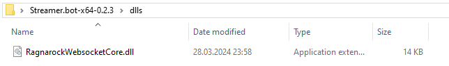
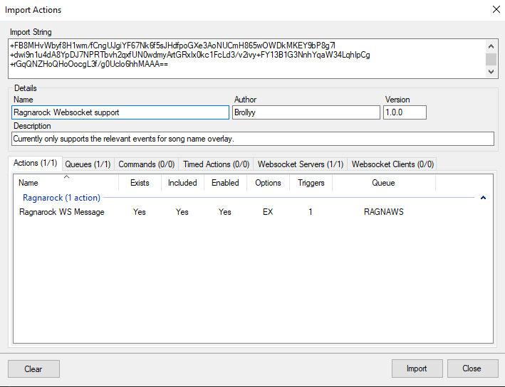
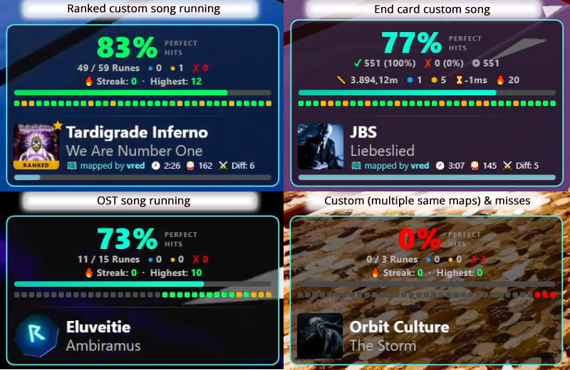

# Ragnarock - Streamer.bot - Enhanced (Continuation)

This project is based on the original work of [Brolly](https://github.com/Brollyy). Thanks a lot for your work!

The original code and documentation were created by them under [Ragnarock-Streamer.bot](https://github.com/Brollyy/Ragnarock-Streamer.bot).

This repository is maintained independently and continues development after the original project became inactive.

The goal of this continuation is to provide a stable setup for the "[Enhanced Overlay Setup](#-enhanced-overlay)" for [Streamer.bot](https://streamer.bot) users (tested with Streamer.bot 1.0.4), while also preserving compatibility with the original implementation.

The "Enhanced Overlay" completes and expands upon the original idea of adding statistics to the overlay by combining them with enhanced song information and additional [features](#overlay-features).

---

## 📌 Contents

### 🔧 Setup
- [Prerequisites](#-prerequisites-original) (essential for original as for enhanced)

### 📦 Original Project
- [Original component: Song Overlay](#-original-overlay---displaying-artist-and-title)
- [Original component: Ineractive Commands](#-original-interaction-commands)
- [Original repository contact](#-original-contact-legacy-support)

### 🚀 This Version (Enhanced Overlay)
- [Enhanced Overlay Setup](#-enhanced-overlay)
- [Support](#-project-support-this-enhanced-overlay-version)

---

# 🔧 Prerequisites (Original)

This section is from the original project by [Brolly](https://github.com/Brollyy) and has not been modified.<br>
These steps need to be done even if you only want the "Enhanced Overlay" to work:

1. Copy the contents of `dlls` folder from this repository into the `dlls` folder in your Streamer.bot folder.
<br />
2. Open `%LocalAppData%\Ragnarock\Saved\Config\WindowsNoEditor\Game.ini` and make sure these lines are in there:
    ```ini
    CustomSocketURL="ws://{localIPv4}:8033/"
    CustomSocketIsEnabled=True
    ```
    Remember to replace `{localIPv4}` with your local IP address - this can be checked by e.g. running `ipconfig` in the command line.
    ```c
    C:\Users\***>ipconfig

    Windows IP Configuration

    ...

    Wireless LAN adapter Wi-Fi:

        Connection-specific DNS Suffix  . :
        Link-local IPv6 Address . . . . . : ***
        IPv4 Address. . . . . . . . . . . : 192.168.18.3
        Subnet Mask . . . . . . . . . . . : ***
        Default Gateway . . . . . . . . . : ***
    ```
    In this case the relevant lines in `Game.ini` would look like this:
    ```ini
    CustomSocketURL="ws://192.168.18.3:8033/"
    CustomSocketIsEnabled=True
    ```

    **WARNING**: if your local network uses DHCP, this address may periodically change, requiring update to `Game.ini`. Assign a static IP address to your PC if possible to avoid that.
3. Import `RagnarockWebsocketCore.bot` into Streamer.bot to enable a custom Websocket server communication with the game.<br>
    

---

# 📦 Original Overlay - displaying artist and title 

This section is from the original project by Brollyy.

[Overlay for displaying current song name and artist](2_SongNameOverlay/README.md)

---

# 📦 Original Interaction commands

This section is from the original project by Brollyy.

[Interaction commands](1_InteractionCommands/README.md)

---

# 📬 Original Contact (Legacy Support)

If you have issues related to the original project version, you can contact the original author:

- Discord: @brollyy
- GitHub: https://github.com/Brollyy

Please do not contact them regarding issues in this "Enhanced Overlay" continuation.

---

# 🚀 Enhanced Overlay

This section describes the additional features added in this continuation.<br>
> [!WARNING]
> If you use this, the "[original song overlay](#-original-overlay---displaying-artist-and-title)" will be overwritten as the song information is also available in the statistic overlay. The [original Ineractive Commands](#-original-interaction-commands) will continue to work.

This step completes the original idea of implementing statistics and added some more functionality and additional song information (where available).

## Setup
- Import the [actions](3_Enhanced_SongOverlay_including_Statistics/RagnarockEnhancedOverlay-for-Streamer.bot) into your Streamer.bot
- Put the files in [resources](3_Enhanced_SongOverlay_including_Statistics/resources) (logo.webp, overlay.html) into a directory of your choice
- Add a browser source to your OBS and load overlay.html as local file
- Don't forget to have your Streamer.bot AND Ragnarock Custom Websocket (inside Streamer.bot) running
- The standard HTTP websocket server of Streamer.Bot (Port 8080) must be running

## Overlay features



- The overlay always shows:
  - Perfect hits in percentage
  - x / y Runes hit perfectly
  - Amount of blue combos
  - Amount of yellow combos
  - Amount of misses
  - Current Perfect Hit Streak & Highest Perfect Hit Streak
  - Progress bar for Perfect Hits percentage
  - 35 dots representing the last 35 runes colored
      - red for a missed rune
      - yellow for a non-perfect hit rune
      - green for a perfect hit rune (+/- 15ms around the beat)
  - The artist
  - The song title

- The overlay **might** show for some base game songs:
  - A cover image (if available), else a ragnarock rune placeholder image
 
- For custom songs from [Ragnacustoms.com](https://ragnacustoms.com), the overlay may additionally display:
  - A cover image, Mapper name, song length, BPM, available difficulties, song progression bar
  - Labels a "ranked song" with a "Ranked" badge and a star

- The overlay will show an end card with statistics:
  - Perfect Hits (in %), total of hit runes, total of missed runes, total of runes, distance, blue combos, yellow combos, delay in ms, highest perfect hit streak

## Notes
- All comparisons are only made with [Ragnacustoms.com](https://ragnacustoms.com) as THE source for Ragnarock custom songs. Playing songs from other sources is untested and will not be supported.
- In case a song is available more than once (2 customs, or 1 base game + 1 custom with the same artist + title) the additional data will not be available to avoid displaying information from mapper A while playing a map by mapper B. I follow the "rather no information than wrong information" rule here.
- Base game songs are supported up to "Viking music pack" (or for a  more specific and current date: currently May 18th 2026). Additional official DLC might need an update in the Streamer.bot actions.
- On some songs the song length might not be available if the information is missing or obviously incorrect.
- On some songs the song progression bar might not be available, if some necessary information are not provided.
- The song progression bar is calculated with help of rune placement information, song length and bpm. As the game does not provide any information when for example a user is pausing the game, a timeline would continue to progress. As a workaround information from rune positions in song along with bpm and song length is used, so this system will work even with pausing a song and is more or less nearly as accurate for most songs. That is why it is called song progression bar and not timeline.
- The game only tells the state of "Song Start" and "Song End". On "song start" the overlay is displaying, on "song end" the end statistic scorecard will show up. As we do not have any other information a "fade out" after 30 seconds is added when the "song end" information comes in. Therefore the overlay end card will fade out eventually, either after 30 seconds or if you just start a new song.
- Be aware, the game is not really telling a lot. That is also why I decided to just list available difficulties in the song overlay as a general information that a map might have other diffs to play, hence the game does not communicate which difficulty currently really is being played.
- If you have any more ideas or questions, feel free to reach out via Discord (@xoanon) and I can evaluate if your ideas will be possible or I can provide more information here why something might not work with current possibilities/information available.

---

# 🛠 Project Support (This "Enhanced Overlay" version)

This repository is maintained independently and is not affiliated with the original author.

For issues related to this continuation:
- Discord: @xoanon
- GitHub: https://github.com/Xoanon80
- Or request a song that might not work correctly at one of my Raganrock streams to verify the bug: [My Twitch](https://twitch.tv/Xoanon) 

---

# 📌 Notes

- Original project: maintained by [Brollyy](https://github.com/Brollyy)
- This "Enhanced Overlay" continuation: Maintained by [Xoanon](https://github.com/Xoanon80)
- This version may diverge significantly from the original over time.
